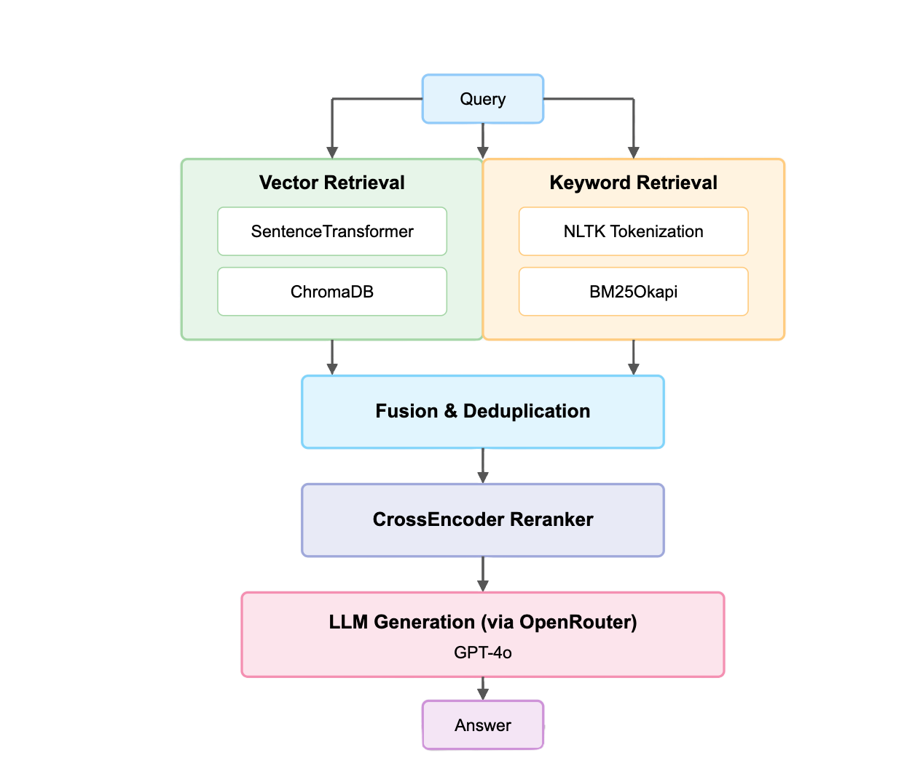
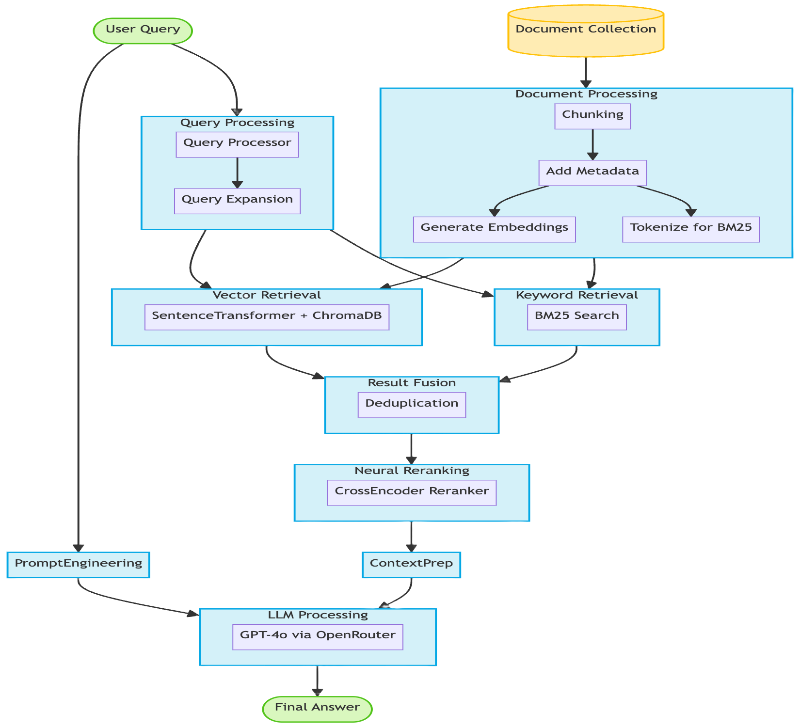

# DSPy RAG Hybrid Pipeline and inference pipeline using LitServe with BM25, Embedding, Rerank and LLM
---
## Project Overview

This project demonstrates a Retrieval-Augmented Generation (RAG) pipeline built with DSPy and inference pipeine using LitServe. It combines keyword search (BM25) and dense vector search (ChromaDB with Sentence Transformers) followed by a reranking step (Cross-Encoder) to retrieve relevant context for a Language Model (LLM) to generate an answer. The project includes both a command-line interface (`cli.py`) with improved argument handling and an interactive Streamlit web application (`app.py`). ChromaDB telemetry is disabled, and separate database paths are used for the CLI and Streamlit app to prevent conflicts.

---
## Architecture Diagram



## Architecture Flow Diagram



## Architecture Flow

1.  **Query Input**: The user provides a query.
2.  **Hybrid Retrieval**:
    *   **Vector Retrieval**: The query is embedded using SentenceTransformer and searched in ChromaDB for similar documents.
    *   **Keyword Retrieval**: The query is tokenized (NLTK), and BM25Okapi retrieves relevant documents by keyword match.
3.  **Fusion & Deduplication**: Results from both retrieval methods are merged and deduplicated to form a single candidate set.
4.  **CrossEncoder Reranker**: The candidate documents are reranked for relevance to the query using a CrossEncoder model.
5.  **LLM Generation**: The top reranked context is sent to an LLM (via OpenRouter) to generate a final answer.
6.  **Answer Output**: The answer is returned to the user.

---

## Features

*   **Hybrid Retrieval**: Combines dense embedding (vector) search and BM25 keyword search.
*   **Fusion & Deduplication**: Merges results from both retrieval strategies.
*   **Neural Reranking**: Uses a CrossEncoder model to rerank the fused results for relevance.
*   **LLM Generation**: Generates answers using a large language model, conditioned on the top reranked context.
*   **LitServe API**: Provides a RESTful API for programmatic access.
*   **Streamlit Interface**: Provides a web UI for interacting with the RAG pipeline.
*   **Command-Line Interface**: Offers a CLI (`cli.py`) for indexing and querying, with clear argument requirements.
*   **Separate DB Paths**: Uses distinct ChromaDB directories for API (`./chroma_db_api`), CLI (`./chroma_db_dspy`) and Streamlit (`./chroma_db_dspy_st`) modes.
*   **ChromaDB Telemetry Disabled**: Configured to prevent sending anonymized usage data.
*   **Logging Control**: Suppresses verbose `INFO` logs from underlying libraries like `httpx` and `LiteLLM`.
*   **`src` Layout**: Organizes source code cleanly within a `src` directory.

## Optional LLM Generation (API (through api_client), Streamlit & CLI)

The Api (through api_client), Streamlit app and the CLI now support toggling LLM answer generation. You can choose to either generate an answer using a large language model (LLM), or just view the top reranked context (retrieved documents) without LLM generation.

### LitServe API (`api.py`)
The LitServe API server (`api.py`) supports both LLM generation and retrieval/rerank modes.

- **api_client.py**
    The `api_client.py` script provides a simple example of how to interact with the LitServe API server. It demonstrates how to send a POST request to the `/predict` endpoint with a JSON payload containing a query.

### Streamlit Web App (`app.py`)

When you run the Streamlit app, you'll see a checkbox labeled **"Enable LLM Generation"** in the sidebar:

- **Checked:** The app will generate and display an LLM answer to your query (using the reranked context as input).
- **Unchecked:** The app will only display the reranked context (top documents), without generating an LLM answer.

This allows you to control LLM usage interactively during your session.

### Command-Line Interface (`cli.py`)

The CLI provides a `--llm` flag to control LLM generation:

- **With `--llm`:**
  ```bash
  uv run python cli.py --query "What is DSPy?" --llm
  ```
  The pipeline will generate and print the LLM answer.
- **Without `--llm`:**
  ```bash
  uv run python cli.py --query "What is DSPy?"
  ```
  Only the reranked context (top documents) will be printed, with no LLM answer.

This makes it easy to use the pipeline for pure retrieval/rerank or full RAG with LLM, depending on your needs.

**Note:** LLM generation requires a valid API key and model configuration (see environment variables section below).

---

## Step-by-Step Setup & Usage

### 1. Install [uv](https://github.com/astral-sh/uv) (if not already)

```bash
pip install uv
```

### 2. Sync Dependencies and Create Virtual Environment
This project uses `pyproject.toml` for dependency management. Run:
```bash
uv sync
```
This will create a `.venv` directory and install all dependencies.

### 3. Activate the Virtual Environment
- On **Unix/Mac**:
  ```bash
  source .venv/bin/activate
  ```
- On **Windows**:
  ```bash
  .venv\Scripts\activate
  ```

### 4. Prepare Environment Variables
Create a `.env` file (see `.env.example`) with the following variables:
```dotenv
OPENROUTER_API_KEY=your_openrouter_api_key
EMBEDDER_MODEL=all-mpnet-base-v2
RERANKER_MODEL=cross-encoder/ms-marco-MiniLM-L6-v2
LLM_MODEL=openai/gpt-3.5-turbo
K_EMBEDDING_RETRIEVAL=10
K_BM25_RETRIEVAL=10
K_RERANK=3
CHROMA_DB_PATH=./chroma_db_dspy         # Path for cli.py
CHROMA_DB_PATH_ST=./chroma_db_dspy_st   # Path for app.py (Streamlit)
CHROMA_COLLECTION_NAME=hybrid_rag_docs
```

**Configuration Usage Update:**
All configuration variables (model names, retrieval parameters, ChromaDB paths, etc.) are now accessed via the `config` object in code. Do **not** import configuration values directly from `config.py`—instead, use `config.<VAR>` (e.g., `config.EMBEDDER_MODEL`, `config.K_BM25_RETRIEVAL`). This ensures a single source of truth and easier environment-driven configuration.

- The `.env` file is loaded on startup, and all config values are available as attributes of the `config` object in `src/dspy_rag_app/config.py`.
- If you add new config variables, update both `.env` and the `Config` class in `config.py`.

### 5. Download NLTK Data (if needed)
The scripts (`api.py`, `cli.py` and `app.py`) will automatically attempt to download 'punkt' and 'stopwords' via the `ensure_nltk_resources` function if they are not found in the standard NLTK data path.

### 6. Run the Application

You have two main ways to run the application:

*   **Command-Line Interface (cli.py):**
    This script requires a query (`--query`) to run. Optionally, you can provide a file (`--file`) containing documents (one per line) to index its content. **If `--file` is not provided, the script uses a default set of documents defined in `src/dspy_rag_app/data.py`.** If you provide a file, a query is mandatory. Use `uv run` to execute it within the managed environment:

    **Arguments:**
    *   `-f, --file FILE_PATH`: (Optional) Path to a `.txt` file containing documents (one per line). If provided, these documents will be indexed instead of the defaults. Requires `--query` to be specified as well.
    *   `-q, --query QUERY_TEXT`: (Required) Query string to run against the indexed documents (either default or from `--file`).
    *   `--llm`: (Optional) Enable LLM answer generation. If not set, only reranked context is shown.

    **Examples:**
    ```bash
    # Use default documents and run a specific query (reranked context only)
    uv run python cli.py --query 'What is DSPy?'

    # Use default documents and get an LLM answer
    uv run python cli.py --query 'What is DSPy?' --llm

    # Index 'my_docs.txt' and run a specific query (LLM answer)
    uv run python cli.py --file path/to/my_docs.txt --query 'Summarize the file.' --llm
    ```

*   **Streamlit Web Interface (app.py):**
    This provides an interactive web UI. It attempts to load previously indexed data (from its specific path `chroma_db_dspy_st/`) automatically. If none exists, or if you want to index new data, you can upload/paste text and index it via the sidebar. Use `uv run` to start the Streamlit server:
    ```bash
    uv run streamlit run app.py
    ```

 *  **API Server (LitServe, `api.py`)**

    A FastAPI-compatible API server is provided via `api.py` using [LitServe](https://github.com/Lightning-AI/litserve). This allows you to serve the full DSPy RAG pipeline as a REST API for programmatic access or integration with other services.

    ### Running the API Server

    Start the API server:
    ```bash
    uv run python api.py
    ```

    By default, the server will listen on `localhost:8000` (configurable via LitServe options).

    ### Programmatic API Usage (Python Client)

    You can interact with the API server programmatically using Python. The provided `api_client.py` script demonstrates how to send a POST request to the `/predict` endpoint:

    ```python
    uv run python api_client.py
    ```

    - Ensure the API server is running before executing the client script.

    ### API Endpoint

    - **POST** `/predict`
        - **Request Body:** JSON with a `question` field (string)
        - **Example:**
        ```json
        { "question": "What is DSPy?" }
        ```
        - **Response:** JSON with the generated answer and supporting context.

    ### Project Structure

```
dspy-rag-bm25-rerank-llm/
├── .env.example             # Environment variables template
├── .gitignore              # Git ignore rules
├── .streamlit/             # Streamlit configuration
│   └── config.toml         # Streamlit app settings
├── .venv/                  # Python virtual environment
├── README.md               # Project documentation (this file)
├── api.py                  # LitServe API server
├── api_client.py           # API client example
├── app.py                  # Streamlit web interface
├── assets/                 # Static assets
│   ├── architecture-flow.png
│   └── architecture.png
├── cli.py                  # Command line interface
├── memory-bank/            # Project documentation
│   ├── activeContext.md
│   ├── decisionLog.md
│   ├── productContext.md
│   ├── progress.md
│   └── systemPatterns.md
├── pyproject.toml         # Python project configuration
├── src/                   # Source code
│   └── dspy_rag_app/       # Main application package
│       ├── __init__.py
│       ├── bm25_utils.py   # BM25 utilities
│       ├── config.py       # Configuration loader
│       ├── data.py        # Default document data
│       ├── nltk_utils.py   # NLTK utilities
│       ├── rag_pipeline.py # RAG pipeline implementation
│       ├── retrievers.py   # Custom retrievers
│       └── utils.py        # Utility functions
└── uv.lock                # UV dependency lock file
```

## Features
    - Loads all models, retrievers, and pipeline components on startup (see `setup` method in `api.py`).
    - Handles document indexing and BM25/ChromaDB setup automatically.
    - Returns detailed error messages for invalid requests or internal errors.
    - Uses the same configuration and document corpus as the CLI and Streamlit app.

    ### Example cURL Request
    ```bash
    curl -X POST http://localhost:8000/predict \
        -H "Content-Type: application/json" \
        -d '{"question": "What is DSPy?"}'
    ```

## What Happens Internally (Example: api.py litserve execution)?

This section explains the internal flow when running the API server using `api.py` with LitServe, providing a step-by-step overview of what happens under the hood:

1. **Server Startup**
   - The server is started by running `python api.py` (typically via `uv run python api.py`).
   - Environment variables are loaded from `.env`.
   - NLTK resources are ensured to be present for text processing.
   - An instance of `DSPyRAGAPI` (a subclass of `ls.LitAPI`) is created.
   - A `LitServer` is instantiated with this API and started on the specified port (default: 8001).

2. **Component Initialization (`setup` method)**
   - Runs once per worker process, triggered by LitServe.
   - Loads all core components (embedder, reranker, ChromaDB client, LLM) using utility functions.
   - Retrieves or creates the ChromaDB collection for document storage.
   - Checks if the collection is empty or out-of-sync with the expected document IDs; if so, it (re)indexes all documents.
   - Builds a BM25 index for fast keyword-based retrieval.
   - Instantiates DSPy retrievers (Chroma and BM25) and the RAG pipeline, wiring together all components.

3. **Request Handling**
   - For each incoming API request, LitServe calls the following methods in order:
     - **`decode_request`**: Parses the incoming JSON request, extracting the `question` field.
     - **`predict`**: Runs the DSPy RAG pipeline with the provided question. This involves retrieving relevant documents, reranking, and generating an answer using the LLM.
     - **`encode_response`**: Formats the prediction (answer) into a JSON response to be returned to the client.

4. **Error Handling & Logging**
   - Each stage includes logging for debugging and performance monitoring (e.g., setup time, prediction time, errors).
   - Errors are caught and returned as structured API errors using LitServe's error handling mechanisms.

This design ensures that the API server is robust, modular, and ready for production or integration with other services. The internal flow mirrors the modularity and extensibility of the DSPy RAG pipeline, making it easy to adapt or extend for new use cases.

### 7. What Happens Internally (Example: `cli.py` execution)?

When you run `uv run python cli.py --query 'some query'`:

*   **Load Components (`utils.load_components`)**:
    *   Loads configuration from `.env` via <mcfile name="config.py" path="src/dspy_rag_app/config.py"></mcfile>.
    *   Initializes the embedding model (`SentenceTransformer`), reranking model (`CrossEncoder`), and LLM (`dspy.LM` via OpenRouter).
    *   Initializes the ChromaDB client (`chromadb.PersistentClient`) using the CLI path (`CHROMA_DB_PATH`) and **disables telemetry**.
    *   Configures DSPy settings globally with the loaded LLM.
    *   Suppresses `INFO` level logs from `httpx` and `LiteLLM`.
*   **Parse Arguments (`cli.py`)**:
    *   Processes command-line arguments (`--file`, `--query`).
    *   Determines the document source: uses the file specified by `--file` or defaults to documents in <mcfile name="data.py" path="src/dspy_rag_app/data.py"></mcfile> if `--file` is omitted.
    *   Ensures a query is provided.
*   **Index Data (`utils.index_chroma_data`, `utils.create_bm25_index`)**:
    *   **ChromaDB Indexing**:
        *   Gets or creates the ChromaDB collection specified in `config.py`.
        *   Clears any existing documents from the collection (default behavior).
        *   Generates vector embeddings for the documents using the loaded embedder.
        *   Upserts the documents, embeddings, and IDs into the ChromaDB collection.
    *   **BM25 Indexing**:
        *   Preprocesses the documents for keyword search using functions in <mcfile name="bm25_utils.py" path="src/dspy_rag_app/bm25_utils.py"></mcfile> (e.g., tokenization, stopword removal via NLTK).
        *   Builds a BM25 keyword index (`rank_bm25.BM25Okapi`) from the preprocessed documents.
*   **Create Retrievers (`utils.create_retrievers`)**:
    *   Instantiates the custom <mcsymbol name="ChromaRetriever" filename="retrievers.py" path="/Users/srini/Ws/dspy-rag-bm25-rerank-llm/src/dspy_rag_app/retrievers.py" startline="13" type="class"></mcsymbol> using the ChromaDB collection and embedder.
    *   Instantiates the custom <mcsymbol name="BM25Retriever" filename="retrievers.py" path="/Users/srini/Ws/dspy-rag-bm25-rerank-llm/src/dspy_rag_app/retrievers.py" startline="35" type="class"></mcsymbol> using the BM25 index and the original document corpus.
    *   Both retrievers are configured with their respective `k` values from `config.py`.
*   **Create RAG Pipeline (`utils.create_rag_pipeline`)**:
    *   Instantiates the main DSPy module, <mcsymbol name="RAGHybridFusedRerank" filename="rag_pipeline.py" path="/Users/srini/Ws/dspy-rag-bm25-rerank-llm/src/dspy_rag_app/rag_pipeline.py" startline="10" type="class"></mcsymbol>, defined in <mcfile name="rag_pipeline.py" path="src/dspy_rag_app/rag_pipeline.py"></mcfile>.
    *   This pipeline module integrates:
        *   The vector retriever (<mcsymbol name="ChromaRetriever" filename="retrievers.py" path="/Users/srini/Ws/dspy-rag-bm25-rerank-llm/src/dspy_rag_app/retrievers.py" startline="13" type="class"></mcsymbol>).
        *   The keyword retriever (<mcsymbol name="BM25Retriever" filename="retrievers.py" path="/Users/srini/Ws/dspy-rag-bm25-rerank-llm/src/dspy_rag_app/retrievers.py" startline="35" type="class"></mcsymbol>).
        *   The reranking model (`CrossEncoder`).
        *   The LLM (`dspy.LM`).
    *   It's configured with the `rerank_k` value from `config.py`.
*   **Run Query (`cli.py`)**:
    *   Calls the forward method of the <mcsymbol name="RAGHybridFusedRerank" filename="rag_pipeline.py" path="/Users/srini/Ws/dspy-rag-bm25-rerank-llm/src/dspy_rag_app/rag_pipeline.py" startline="10" type="class"></mcsymbol> instance with the user's query (`args.query`).
    *   Internally, the pipeline performs:
        1.  Retrieval using both vector and keyword retrievers.
        2.  Fusion and deduplication of results.
        3.  Reranking of fused results using the CrossEncoder.
        4.  Selection of the top `rerank_k` documents as context.
        5.  Generation of the final answer by the LLM using the context.
    *   Prints the generated answer to the console.

*   **Streamlit App (`app.py`)**: Follows a similar flow but uses the separate ChromaDB path (`_st` suffix). It attempts to load existing data first. If new data is provided via the UI, it calls the same utility functions (`index_chroma_data`, `create_bm25_index`, `create_retrievers`, `create_rag_pipeline`) to process and index it before enabling search. Suppresses `httpx` and `LiteLLM` info logs.

### 8. What Happens Internally (Example: `app.py` Streamlit execution)?

When you run `uv run streamlit run app.py`:

*   **Load Components (`utils.load_components`)**:
    *   Loads configuration from `.env` via <mcfile name="config.py" path="src/dspy_rag_app/config.py"></mcfile>.
    *   Initializes the embedding model (`SentenceTransformer`), reranking model (`CrossEncoder`), and LLM (`dspy.LM` via OpenRouter).
    *   Initializes the ChromaDB client (`chromadb.PersistentClient`) using the Streamlit path (`CHROMA_DB_PATH_ST`) and **disables telemetry**.
    *   Configures DSPy settings globally with the loaded LLM.
    *   Suppresses `INFO` level logs from `httpx` and `LiteLLM`.
*   **Streamlit UI Initialization (`app.py`)**:
    *   Renders the web interface, including sidebar for data upload and main area for querying.
    *   Allows users to upload files or paste text to index new documents, or loads previously indexed data from the Streamlit ChromaDB path.
*   **Index Data (on user action)**:
    *   **ChromaDB Indexing**:
        *   Gets or creates the ChromaDB collection specified in `config.py` (using the Streamlit path).
        *   Clears any existing documents from the collection (default behavior).
        *   Generates vector embeddings for the documents using the loaded embedder.
        *   Upserts the documents, embeddings, and IDs into the ChromaDB collection.
    *   **BM25 Indexing**:
        *   Preprocesses the documents for keyword search using functions in <mcfile name="bm25_utils.py" path="src/dspy_rag_app/bm25_utils.py"></mcfile> (e.g., tokenization, stopword removal via NLTK).
        *   Builds a BM25 keyword index (`rank_bm25.BM25Okapi`) from the preprocessed documents.
*   **Create Retrievers (`utils.create_retrievers`)**:
    *   Instantiates the custom <mcsymbol name="ChromaRetriever" filename="retrievers.py" path="/Users/srini/Ws/dspy-rag-bm25-rerank-llm/src/dspy_rag_app/retrievers.py" startline="13" type="class"></mcsymbol> using the ChromaDB collection and embedder.
    *   Instantiates the custom <mcsymbol name="BM25Retriever" filename="retrievers.py" path="/Users/srini/Ws/dspy-rag-bm25-rerank-llm/src/dspy_rag_app/retrievers.py" startline="35" type="class"></mcsymbol> using the BM25 index and the original document corpus.
    *   Both retrievers are configured with their respective `k` values from `config.py`.
*   **Create RAG Pipeline (`utils.create_rag_pipeline`)**:
    *   Instantiates the main DSPy module, <mcsymbol name="RAGHybridFusedRerank" filename="rag_pipeline.py" path="/Users/srini/Ws/dspy-rag-bm25-rerank-llm/src/dspy_rag_app/rag_pipeline.py" startline="10" type="class"></mcsymbol>, defined in <mcfile name="rag_pipeline.py" path="src/dspy_rag_app/rag_pipeline.py"></mcfile>.
    *   This pipeline module integrates:
        *   The vector retriever (<mcsymbol name="ChromaRetriever" filename="retrievers.py" path="/Users/srini/Ws/dspy-rag-bm25-rerank-llm/src/dspy_rag_app/retrievers.py" startline="13" type="class"></mcsymbol>).
        *   The keyword retriever (<mcsymbol name="BM25Retriever" filename="retrievers.py" path="/Users/srini/Ws/dspy-rag-bm25-rerank-llm/src/dspy_rag_app/retrievers.py" startline="35" type="class"></mcsymbol>).
        *   The reranking model (`CrossEncoder`).
        *   The LLM (`dspy.LM`).
    *   It's configured with the `rerank_k` value from `config.py`.
*   **Run Query (on user action)**:
    *   When the user enters a query and clicks 'Search', the pipeline is executed with the query.
    *   Internally, the pipeline performs:
        1.  Retrieval using both vector and keyword retrievers.
        2.  Fusion and deduplication of results.
        3.  Reranking using the CrossEncoder.
        4.  Answer generation using the LLM.
    *   The answer is displayed in the Streamlit UI.


---
### 10. Customization
- Add your own default documents to the `DOCUMENTS` list in `src/dspy_rag_app/data.py`.
- Change retrieval, rerank parameters, model names, or paths via the `.env` file.
- Modify the core pipeline logic in `src/dspy_rag_app/rag_pipeline.py` or the utility functions in `src/dspy_rag_app/utils.py`.

### 11. Troubleshooting
- Ensure your `.env` is set up and API keys are valid.
- If you see NLTK errors, delete `.venv/nltk_data` and rerun.
- For LLM errors, check your OpenRouter API key and model name.

---

## Project Structure

```
dspy-rag-bm25-rerank-llm/
├── .env.example             # Environment variables template
├── .gitignore              # Git ignore rules
├── .streamlit/             # Streamlit configuration
│   └── config.toml         # Streamlit app settings
├── .venv/                  # Python virtual environment
├── README.md               # Project documentation (this file)
├── api.py                  # LitServe API server
├── api_client.py           # API client example
├── app.py                  # Streamlit web interface
├── assets/                 # Static assets
├── cli.py                  # Command line interface
├── memory-bank/            # Project documentation
├── pyproject.toml         # Python project configuration
├── src/                   # Source code
│   └── dspy_rag_app/       # Main application package
│       ├── __init__.py
│       ├── bm25_utils.py   # BM25 utilities
│       ├── config.py       # Configuration loader
│       ├── data.py        # Default document data
│       ├── nltk_utils.py   # NLTK utilities
│       ├── rag_pipeline.py # RAG pipeline implementation
│       ├── retrievers.py   # Custom retrievers
│       └── utils.py        # Utility functions
└── uv.lock                # UV dependency lock file
```

---

## References

### Core Technologies
- [DSPy](https://github.com/stanfordnlp/dspy): Framework for programming with foundation models
- [LitServe](https://github.com/Lightning-AI/litserve): Lightweight model serving framework
- [FastAPI](https://fastapi.tiangolo.com/): Modern Python web framework for APIs
- [ChromaDB](https://www.trychroma.com/): Vector database for embeddings
- [Sentence Transformers](https://www.sbert.net/): Library for sentence embeddings
- [Cross-Encoder](https://www.sbert.net/examples/applications/cross-encoder/README.html): Reranking models
- [BM25](https://en.wikipedia.org/wiki/Okapi_BM25): Probabilistic relevance algorithm

### Supporting Libraries
- [Streamlit](https://streamlit.io/): Web application framework
- [NLTK](https://www.nltk.org/): Natural language toolkit
- [OpenRouter](https://openrouter.ai/): Unified LLM API access
- [uv](https://github.com/astral-sh/uv): Fast Python package installer

### Documentation & Resources
- [DSPy Documentation](https://dspy-docs.vercel.app/)
- [LitServe Examples](https://github.com/Lightning-AI/litserve/tree/main/examples)
- [FastAPI Tutorial](https://fastapi.tiangolo.com/tutorial/)
- [ChromaDB Documentation](https://docs.trychroma.com/)

